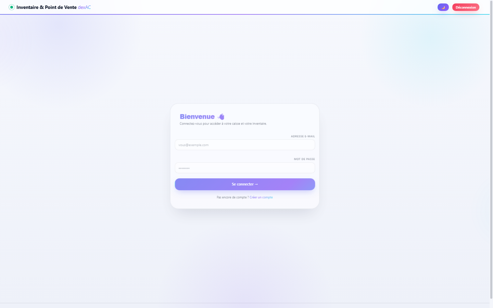
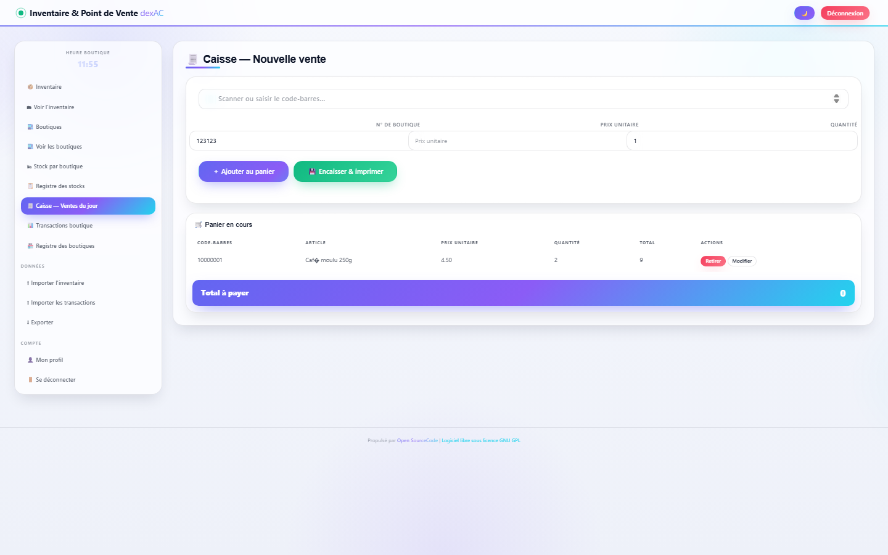
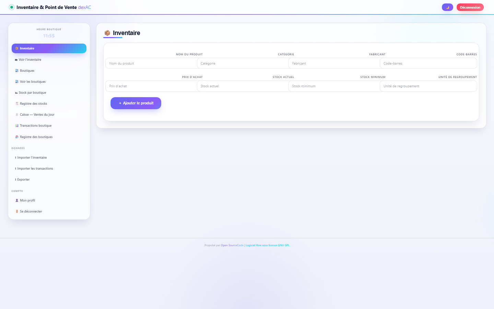
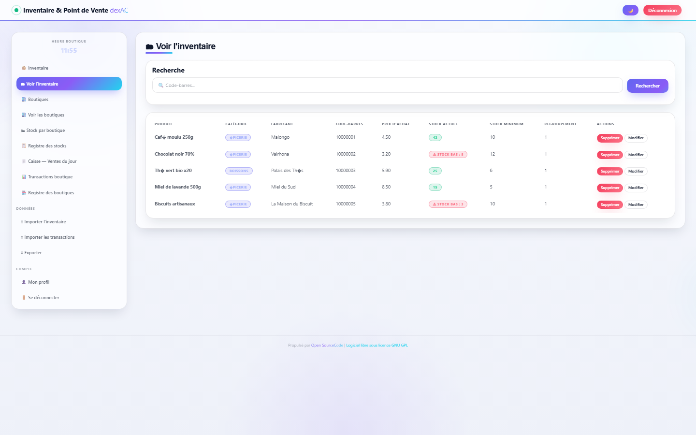
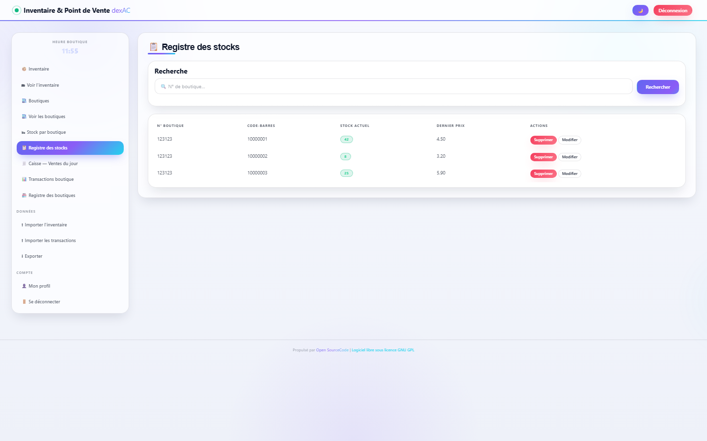
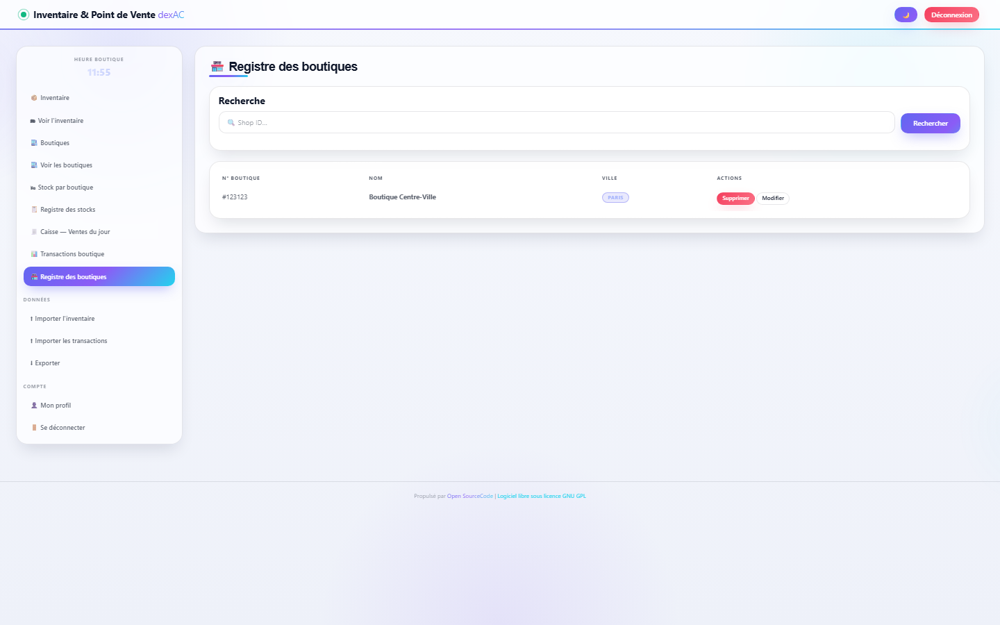
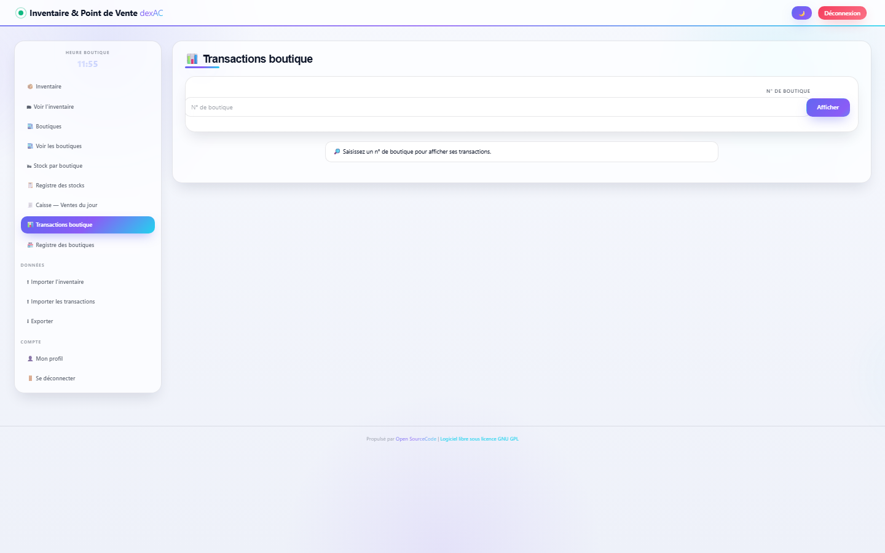
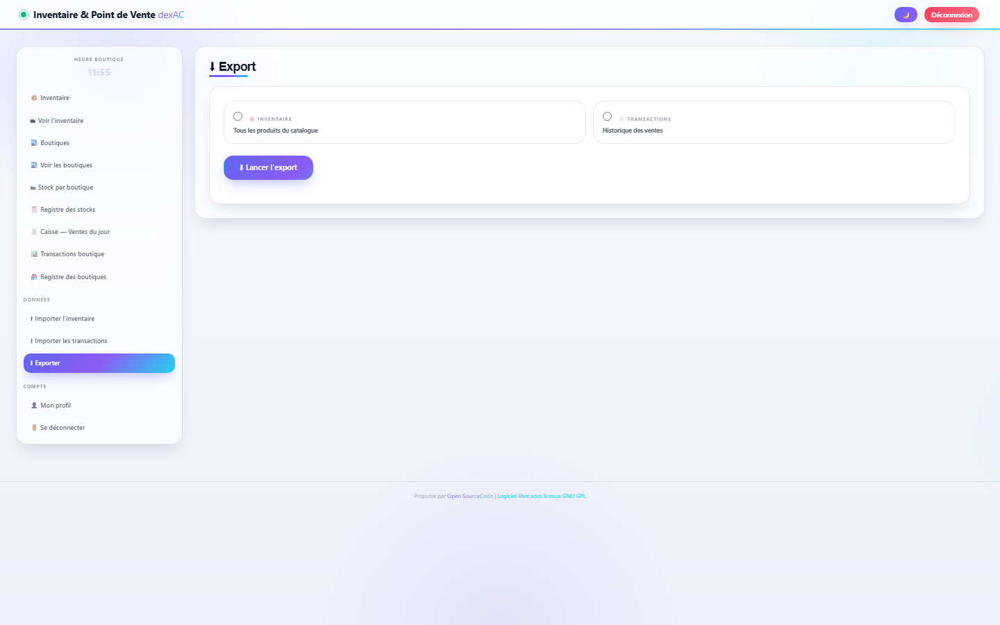
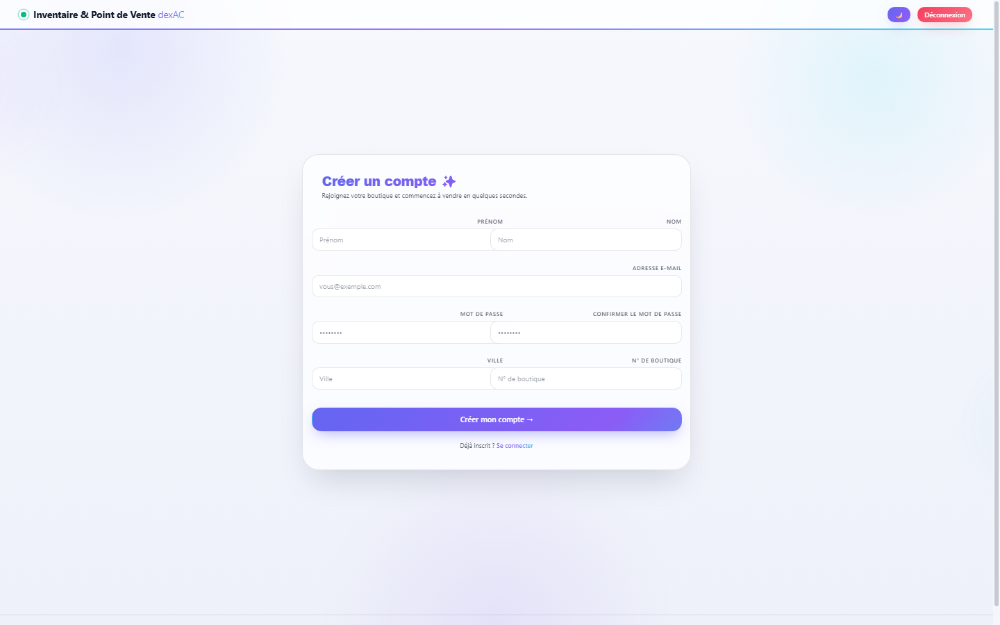
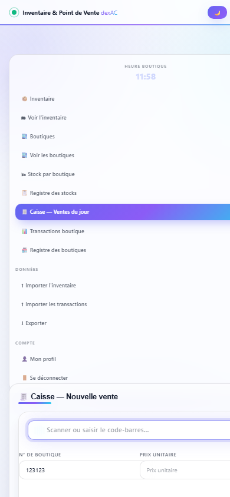

# 🛒 dexAC — Système d'Inventaire & Point de Vente (POS)


Application web complète de **caisse et gestion d'inventaire multi-boutiques**, entièrement **en français**, avec une interface modernisée en **glassmorphism** (thème sombre/clair automatique), des animations fluides et un design **100 % responsive** (desktop, tablette, mobile).

> Refonte UI/UX 2026 du projet original *Web Based Inventory and POS in PHP* — logique métier PHP conservée, interface entièrement repensée.

---

## 📑 Sommaire

- [📸 Aperçu des écrans](#-aperçu-des-écrans)
- [✨ Fonctionnalités](#-fonctionnalités)
  - [🔐 Authentification & comptes](#-authentification--comptes)
  - [🧾 Point de vente (caisse)](#-point-de-vente-caisse)
  - [📦 Inventaire multi-boutiques](#-inventaire-multi-boutiques)
  - [🏬 Gestion du réseau](#-gestion-du-réseau)
  - [📊 Données & échanges](#-données--échanges)
  - [🎨 Interface (refonte 2026)](#-interface-refonte-2026)
- [🧰 Stack technique](#-stack-technique)
- [🚀 Installation](#-installation)
- [📁 Structure du projet](#-structure-du-projet)
- [🗃 Schéma de la base](#-schéma-de-la-base)
- [🔒 Avertissement sécurité](#-avertissement-sécurité)
- [📄 Licence](#-licence)

---

## 📸 Aperçu des écrans

### 🔑 Connexion


### 🧾 Caisse — Nouvelle vente
Champ de scan de code-barres auto-focus, panier en cours avec totaux animés, boutons d'encaissement.


### 📦 Inventaire — Ajout de produit
Formulaire en grille adaptative : nom, catégorie, fabricant, code-barres, prix, stocks min/max.


### 🗂 Voir l'inventaire
Liste complète avec badges d'état de stock (⚠️ alerte si stock ≤ minimum), recherche par code-barres, actions modifier/supprimer.


### 📋 Registre des stocks
Stock par boutique avec badges visuels, dernier prix connu.


### 🏪 Registre des boutiques
Gestion du réseau de boutiques avec recherche.


### 📊 Transactions boutique
Historique des ventes avec total en dégradé animé.


### ⬇ Export de données
Export de l'inventaire ou des transactions en fichiers texte.


### ✨ Création de compte
Inscription avec validation (e-mail unique, confirmation du mot de passe).


### 📱 Vue mobile (responsive)
La navigation s'empile au-dessus du contenu — tableaux convertis en cartes lisibles.


---

## ✨ Fonctionnalités

### 🔐 Authentification & comptes
- Connexion par e-mail / mot de passe avec sessions PHP
- Création de compte avec contrôles (e-mail unique, mots de passe identiques)
- Profil utilisateur modifiable (prénom, nom, ville, boutique, mot de passe)
- Déconnexion sécurisée

### 🧾 Point de vente (caisse)
- **Champ de scan** de code-barres avec auto-focus (compatible douchette USB)
- Panier en cours persistant en base (`temptrans`) — survit à un rafraîchissement
- Ajout, modification de quantité, retrait d'articles
- **Total animé** en barre dégradée avec compteur progressif
- Encaissement : le panier est archivé dans les transactions du jour (`hqtrnmaster` / `hqtransactions`)
- Mode impression intégré (styles `@media print`)

### 📦 Inventaire multi-boutiques
- Catalogue produits : nom, catégorie, fabricant, code-barres, prix d'achat, stock actuel, stock minimum, unité de regroupement
- **Alertes visuelles** : badge rouge ⚠️ quand le stock passe sous le minimum
- Stock par boutique avec dernier prix connu
- Recherche par code-barres ou par n° de boutique

### 🏬 Gestion du réseau
- Création / modification / suppression de boutiques
- Chaque utilisateur est rattaché à une boutique
- Vue stock boutique par boutique

### 📊 Données & échanges
- **Import en masse** de l'inventaire et des transactions (fichiers `.txt` / `.csv`)
- **Export** de l'inventaire et des transactions
- Historique des transactions par boutique avec totaux

### 🎨 Interface (refonte 2026)
- **Glassmorphism** : cartes translucides, effet de flou d'arrière-plan, bordures lumineuses
- **Thème sombre / clair** : détection automatique des préférences système + bouton de bascule (mémoire locale)
- **Micro-interactions** : effet shine sur les boutons, spotlight suivant le curseur, soulèvement des cartes au survol
- **Animations** : aurore de fond en mouvement, apparition des lignes en cascade, compteurs de totaux progressifs
- **100 % responsive** : grilles CSS adaptatives, tableaux → cartes empilées sur mobile
- **Accessibilité** : respect de `prefers-reduced-motion`, focus visible, contrastes soignés
- **Interface intégralement en français**

---

## 🧰 Stack technique

| Composant | Technologie |
|---|---|
| Backend | PHP 5.6 (API `mysql_*` historique) |
| Base de données | MySQL / MariaDB (schéma `acpos`) |
| Frontend | HTML5, CSS3 moderne (custom properties, grid, backdrop-filter), JavaScript vanilla |
| Design system | `bootstrap_ac/ac-design.css` + thème clair `ac-theme-light.css` |
| Interactions | `js.ac/ac-ui.js` (zéro dépendance) |

---

## 🚀 Installation

### Prérequis
- **WAMP / XAMPP / LAMP** avec **PHP ≤ 5.6** (l'API `mysql_*` a été retirée de PHP 7+)
- MySQL ou MariaDB

### Étapes

1. **Copier le projet** dans le dossier web :
   ```
   C:\wamp64\www\acpos\        (Windows / WAMP)
   /var/www/html/acpos/        (Linux)
   ```

2. **Créer la base** et importer le schéma :
   ```sql
   CREATE DATABASE acpos;
   USE acpos;
   SOURCE DATABASE/acpos.sql;
   ```
   ou en ligne de commande :
   ```bash
   mysql -u root acpos < DATABASE/acpos.sql
   ```

3. **Vérifier la connexion** dans `connection.php` :
   ```php
   $host = "localhost";     // ou "localhost:3307" si MariaDB sur le port 3307
   $db_username = "root";
   $db_password = "";
   $database = "acpos";
   ```

4. **Ouvrir** `http://localhost/acpos/` (ou le port de votre serveur).

### 🔑 Compte de démonstration

| Champ | Valeur |
|---|---|
| E-mail | `happachee@happachee.com` |
| Mot de passe | `happachee` |
| N° boutique | `123123` |

### ⚠️ Notes de compatibilité

- **PHP 7+ ne fonctionne pas** : le projet utilise l'API `mysql_*` (supprimée en PHP 7). Sur WAMP, basculer sur PHP 5.6.
- **MySQL 8/9** : le plugin `caching_sha2_password` n'est pas compris par le client PHP 5.6. Deux options :
  - utiliser **MariaDB** (recommandé — supporte `mysql_native_password`), ou
  - créer un utilisateur dédié en `mysql_native_password`.
- Le client MySQL de PHP 5.6 ne supporte pas `utf8mb4` en handshake : laisser le serveur en `latin1` (défaut historique) ou utiliser MariaDB.

---

## 📁 Structure du projet

```
POS_webased/
├── connection.php              # Connexion base de données
├── index.php                   # Point d'entrée (redirection)
├── login.php / logout.php      # Authentification
├── acCreate.php                # Création de compte
├── myInformation_edition.php   # Profil utilisateur
│
├── transaction.php             # 🧾 Caisse / point de vente
├── acTransaction_record.php    # Historique des transactions
│
├── acInventory.php             # Formulaire produit
├── acInventory_rec.php         # Liste de l'inventaire
├── stock.php / acProduct_rec.php  # Stocks boutique
├── acProduct.php / acProduct_shop.php  # Boutiques
├── acXhop_rec.php              # Registre des boutiques
│
├── import_inv.php / import_trans.php  # Imports CSV/TXT
├── export.php                  # Exports
│
├── pageheader.php              # Header partagé (thème, nav)
├── acWidget.php                # Navigation latérale
├── footer.php                  # Pied de page
│
├── bootstrap_ac/               # Design system
│   ├── ac-design.css           #   Glassmorphism + animations
│   └── ac-theme-light.css      #   Thème clair
├── js.ac/
│   └── ac-ui.js                # Interactions (vanilla JS)
├── DATABASE/
│   └── acpos.sql               # Schéma + données de démo
└── screenshots/                # Captures d'écran du README
```

---

## 🗃 Schéma de la base

| Table | Rôle |
|---|---|
| `users` | Comptes utilisateurs (rattachés à une boutique) |
| `shopslist` | Réseau de boutiques |
| `hqpdts` / `hqinv` | Catalogue produits / inventaire siège |
| `hqstock` | Stock par boutique |
| `hqtrnmaster` / `hqtransactions` | En-têtes et lignes de ventes |
| `temptrans` | Panier en cours (par boutique) |

---

## 🔒 Avertissement sécurité

Ce projet est un **exercice pédagogique** issu d'un code open source de 2015. En l'état il présente des failles connues et **ne doit pas être déployé en production** :

- mots de passe stockés en clair,
- requêtes SQL construites par concaténation (risque d'injection),
- pas de protection CSRF ni d'échappement XSS systématique.

Une refonte moderne recommandée (Laravel + PostgreSQL, requêtes préparées, Argon2id, rôles) est décrite dans [`ARCHITECTURE.md`](../ARCHITECTURE.md).

---

## 📄 Licence

Projet original sous **GNU GPL v3** — voir `GNU License v3.txt`.
Refonte UI 2026 : même licence, créditée au projet original (code-projects.org / DEX Connect).
